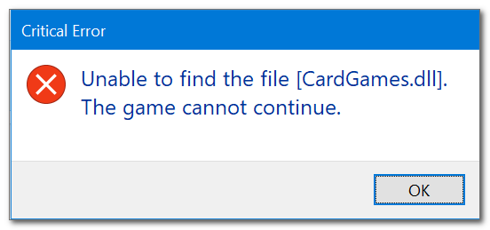

This used to be on another github gists from https://github.com/eladkarako/ but they dont have it up anymore. This really helped me and i couldnt really find great info elsewhere online. The only way to find this was through archive.org. So i thought i might repost this. Some formatting and links might be broken but you should still be able to follow along.

----------

developers may build (since Vista) applications that changes their language,  
to match the OS language.  
the language related embedded-resources are moved to a `.mui` (basically a dll),  
and placed in a folder that is named according to the language  
([`Language Code Identifier (LCID)`](https://web.archive.org/web/20220914142532/https://docs.microsoft.com/en-us/openspecs/windows_protocols/ms-lcid/70feba9f-294e-491e-b6eb-56532684c37f), [`ISO_3166-2`](https://web.archive.org/web/20220914142532/https://en.wikipedia.org/wiki/ISO_3166-2)) the folder may be placed in the same folder as the exe/dll or in another folder that is reachable through `PATH` environment variable (for example - `C:\Windows\System32`).  
"translation" file has the same name as the resource, with additional `.mui` extension.  
the fallback language (what to look for), is pretty much the only thing specified  
in the exe/dll's embedded resource (a Unicode text under MUI resource).

----------

normalizing exe.

for the example I'll use Windows 7 Solitaire.

-   you'll need ResourceHacker.
-   you'll need `Solitaire.exe`, `slc.dll` (and `SolitaireMCE.png` and `CardGames.dll`), in the same folder.
-   you'll also need `en-US/slc.dll.mui` and `en-US/solitaire.exe.mui` (a `en-US` folder in the same folder as `Solitaire.exe`, within the `en-US` folder the `mui` files.

\
|   CardGames.dll
|   slc.dll
|   Solitaire.exe
|   SolitaireMCE.png
|
\--- en-US\
        slc.dll.mui
        solitaire.exe.mui

open `Solitaire.exe` with ResourceHacker.  
note the `MUI` embedded resource (keep it for now).

from the menu above choose "add resource from dll"

select "all files" (there is a bug in how the dialog is set, it will not find `... .exe.mui` files, for example)

and select `solitaire.exe.mui`

)

select "overwrite", you can optionally uncheck the MUI checkbox  
(but we're going to delete it next anyway so it does not matter).

since this is essentially binary modification,  
it is best to do the bare minimal amount of adding/replacing new data,  
there is always a chance of corrupting the files..

just FYI,  
the MUI embedded resource of `solitaire.exe.mui` is slightly different (declares a data file)  

click save.

open that existing `MUI`, right click whatever inside and click delete

repeat if needed until the entry `MUI` itself is gone.

click save (again).

----------

### 

repeat for `slc.dll` and `en-US/slc.dll.mui` .

note: `slc.dll` has no resources, that's fine,  
after you'll import the resources from the `en-US/slc.dll.mui` there will be..  
make sure to remember to delete the the `MUI` as explained before (or not import it).

----------

delete the `..original` files and the `en-US` folder.

----------

your `Solitaire.exe` should be able to launch by itself (that is without `en-US` folder).

### 

bonus:

it will enable you to launch an English version of Solitaire  
even if your Windows is in another language.

----------

the exe will only support ONE language.

Windows7 Solitaire does not have a built-in language selection option,  
and it relays on the Windows MUI alone.

once you've embedded the `en-US` resources,  
you can not embed another language,

(even-though it is perfectly possible. the application simply can't handle it).

if you wish to create another Solitaire,  
you should start with the original exe and dll files again.

you can still find Windows7 MUI language packs on `archive.org`,  
and extract it with 7zip.

----------

note:  
just in-case you've wondered,  
you can NOT embed `CardGames.dll` into `Solitaire.exe`  
(with the method above),  
even-though it is basically a dll filled with plain image resources.

the reference to `CardGames.dll` is (hard-)coded in another area,  
as a Unicode string.

so we'll just let it be..

----------

I should have probably choose a better example than Solitaire (which requires couple of files regardless of the mui changes), such as `calc.exe`..
